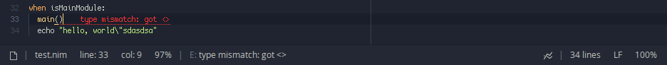

# lint+

An improved linting plugin for [Lite XL](https://github.com/lite-xl/lite-xl).

Includes compatibility layer for [`linter`](https://github.com/drmargarido/linters).

## Screenshots


<p align="center">
Features ErrorLens-style warnings and error messages for quickly scanning
through code for errors.
</p>

<br>


<p align="center">
The status view shows either the first error, or the full message of the error
under your text cursor. No mouse interaction needed!
</p>


## Motivation

There were a few problems I had with the existing `linter` plugin:

- It can only show "warnings" - there's no severity levels
  (info/hint/warning/error).
- It doesn't show the messages after lines (ErrorLens style), you have to hover
  over the warning first.
- It spam-runs the linter command, but Nim (and possibly other languages)
  compiles relatively slowly, which lags the editor to hell.
- It doesn't display the first or current error message on the status view.

lint+ aims to fix all of the above problems.

### Why not just fix `linter`?

- It works fundamentally differently from lint+, so fixing it would be more
  costly than just making a new plugin.
- I haven't ever made my own linter support plugin, so this was a good exercise.

## Installation

Navigate to your `plugins` folder, and clone the repository:

```sh
$ git clone https://github.com/liquidev/lintplus
```

To enable the different linters available on the [linters](linters/)
subdirectory, you have to load them on your lite-xl user module file (`init.lua`).

You can load a single linter:
```lua
local lintplus = require "plugins.lintplus"
lintplus.load("luacheck")
```
or multiple linters by passing a table:
```lua
local lintplus = require "plugins.lintplus"
lintplus.load({"php", "luacheck"})
```

If you want to use plugins designed for the other `linter`, you will also need
to enable the compatibility plugin `linter.lua` *from this repository*.

```sh
$ ln -s $PWD/{lintplus/linter,linter}.lua
```

Keep in mind that plugins designed for `linter` will not work as well as lint+
plugins, because of `linter`'s lack of multiple severity levels. All warnings
reported by `linter` linters will be reported with the `warning` level.

### Automatic Linting

To enable automatic linting upon opening/saving a file, add the following
code tou your lite-xl user module:
```lua
local lintplus = require "plugins.lintplus"
lintplus.setup.lint_on_doc_load()
lintplus.setup.lint_on_doc_save()
```
This overrides `Doc.load` and `Doc.save` with some extra behavior to enable
automatic linting.

## Commands

Available commands from the lite-xl commands palette (ctrl+shift+p):

* `lint+:lint` - run the appropriate linter command for the current document
* `lint+:goto-previous-message` (alt+up) - jump to previous message on current document
* `lint+:goto-next-message` (alt+down) - jump to next message on current document

## Configuration

lint+ itself looks for the following configuration options:

- `config.lint.kind_pretty_names`
  - table:
    - `info`: string = `"I"`
    - `hint`: string = `"H"`
    - `warning`: string = `"W"`
    - `error`: string = `"E"`
  - controls the prefix prepended to messages displayed on the status bar.
    for example, setting `error` to `Error` will display `Error: …` or
    `line 10 Error: …` instead of `E: …` or `line 10 E: …`.
- `config.lint.lens_style`
  - string:
    - `"blank"`: do not draw underline on line messages
    - `"solid"`: draw single line underline on line messages (default)
    - `"dots"`: draw dotted underline on line messages (slower performance)
  - function(x, y, width, color): a custom drawing routine
    - `x`: number
    - `y`: number
    - `width`: number
    - `color`: renderer.color

All options are unset (`nil`) by default, so eg. setting
`config.lint.kind_pretty_names.hint` will *not* work because
`config.lint.kind_pretty_names` does not exist.

Individual plugins may also look for options in the `config.lint` table.
Refer to each plugin's source code for more information.

### Styling

The screenshots above use a theme with extra colors for the linter's messages.
The default color is the same color used for literals, which isn't always what
you want. Most of the time you want to have some clear visual distinction
between severity levels, so lint+ is fully stylable.

- `style.lint`
  - table:
    - `info`: Color - the color used for infos
    - `hint`: Color - the color used for hints
    - `warning`: Color - the color used for warnings
    - `error`: Color - the color used for errors

Example:

```lua
local common = require "core.common"
local style = require "core.style"
style.lint = {
  info = style.syntax["keyword2"],
  hint = style.syntax["function"],
  warning = style.syntax["function"],
  error = { common.color "#FF3333" }
}
```

As with config, you need to provide all or no colors.

## Creating new linters

Just like `linter`, lint+ allows you to create new linters for languages not
supported out of the box. The API is very simple:

```lua
Severity: enum {
  "info",     -- suggestions on how to fix things, may be used in tandem with
              -- other messages
  "hint",     -- suggestions on small things that don't affect program behavior
  "warning",  -- warnings about possible mistakes that may affect behavior
  "error",    -- syntax or semantic errors that prevent compilation
}

LintContext: table {
  :gutter_rail(): number
    -- creates a new gutter rail and returns its index
  :gutter_rail_count(): number
    -- returns how many gutter rails have been created in this context
  -- You may create additional fields in this table, but keys prefixed with _
  -- are reserved by lint+.
}

lintplus.add(linter_name: string)(linter: table {
  filename: pattern,
  procedure: table {
    command: function (filename: string): {string},
      -- Returns the lint command for the given filename.
    interpreter: (function (filename, line: string, context: LintContext):
      function ():
        nil or
        (filename: string, line, column: number,
         kind: Severity, message: string, rail: number or nil)) or "bail"
      -- Creates and returns a message iterator, which yields all messages
      -- from the line.
      -- If the return value is "bail", reading the lint command is aborted
      -- immediately. This is done as a mitigation for processes that may take
      -- too long to execute or block indefinitely.
      -- `rail` is optional and specifies the gutter rail to which the message
      -- should be attached.
  }
})
```

Because writing command and interpreter functions can quickly get tedious, there
are some helpers that return pre-built functions for you:

```lua
lintplus.command(cmd: {string}): function (string): {string}
  -- Returns a function that replaces `lintplus.filename` in the given table
  -- with the linted file's name.
lintplus.interpreter(spec: table {
  info: pattern or nil,
  hint: pattern or nil,
  warning: pattern or nil,
  error: pattern or nil,
    -- Defines patterns for all the severity levels. Each pattern must have
    -- four captures: the first one being the filename, the second and third
    -- being the line and column, and the fourth being the message.
    -- When any of these are nil, the interpreter simply will not produce the
    -- given severity levels.
  strip: pattern or nil,
    -- Defines a pattern for stripping unnecessary information from the message
    -- capture from one of the previously defined patterns. When this is `nil`,
    -- nothing is stripped and the message remains as-is.
})
```

An example linter built with these primitives:

```lua
lintplus.add("nim") {
  filename = "%.nim$",
  procedure = {
    command = lintplus.command {
      "nim", "check", "--listFullPaths", "--stdout", lintplus.filename
    },
    interpreter = lintplus.interpreter {
      -- The format for these three in Nim is almost exactly the same:
      hint = "(.-)%((%d+), (%d+)%) Hint: (.+)",
      warning = "(.-)%((%d+), (%d+)%) Warning: (.+)",
      error = "(.-)%((%d+), (%d+)%) Error: (.+)",
      -- We want to strip annotations like [XDeclaredButNotUsed] from the end:
      strip = "%s%[%w+%]$",
      -- Note that info was omitted. This is because all of the severity levels
      -- are optional, so eg. you don't have to provide an info pattern.
    },
  },
}
```

If you want to let the user of your linter specify some extra arguments,
`lintplus.args_command` can be used instead of `lintplus.command`:

```lua
-- ...
    command = lintplus.args_command(
      { "luacheck",
        lintplus.args,
        "--formatter=visual_studio",
        lintplus.filename },
      "luacheck_args"
    )
-- ...
```

To enable plugins for different languages, do the same thing, but with
`lintplus_*.lua`. For example, to enable support for Nim and Rust:
The second argument to this function is the name of the field in the
`config.lint` table. Then, the user provides arguments like so:

```lua
config.lint.luacheck_args = { "--max-line-length=80", "--std=love" }
```

## Known problems

- Due to the fact that it shows the most severe message at the end of the
  line, displaying more than one message per line is really difficult with
  the limited horizontal real estate, so it can only display one message per
  line.
- It is unable to underline the offending token, simply because some linter
  error messages do not contain enough information about where the error start
  and end is. It will highlight the correct line and column, though.

